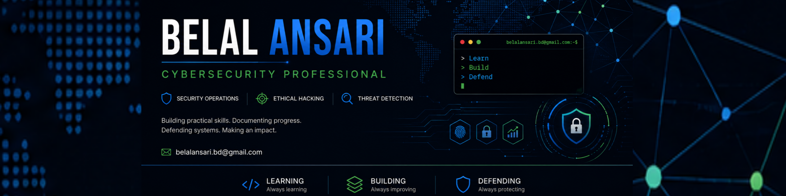

  

  

<h1 align="center">Belal Ansari</h1>

Cybersecurity Professional • Ethical Hacking • Security Operations (SOC) • Threat Detection

---

## Professional Profile

Cybersecurity professional focused on Ethical Hacking, Security Operations (SOC), Threat Detection, Incident Response, and Microsoft Security technologies.

This GitHub profile serves as the central hub for my cybersecurity portfolio, showcasing hands-on laboratories, technical documentation, security research, and practical projects across offensive and defensive security.

My objective is to build practical expertise through continuous learning, real-world simulations, and professional documentation aligned with industry best practices.

---

## Areas of Expertise

### Offensive Security

- Ethical Hacking
- Web Application Security
- Penetration Testing
- Vulnerability Assessment
- Reconnaissance
- OSINT

### Security Operations

- Security Operations Center (SOC)
- Threat Detection
- Threat Hunting
- Incident Response
- Detection Engineering

### Digital Forensics

- Windows Forensics
- Linux Forensics
- Log Analysis
- Malware Analysis

### Microsoft Security

- Microsoft Sentinel
- Microsoft Defender
- Kusto Query Language (KQL)

---

## Technical Skills

| Category | Technologies |
|----------|--------------|
| Operating Systems | Windows • Linux • Kali Linux |
| Networking | TCP/IP • DNS • DHCP • HTTP/HTTPS • Wireshark |
| Security Platforms | Microsoft Sentinel • Splunk |
| Detection | Sigma • YARA |
| Programming & Scripting | Python • Bash • PowerShell |
| Version Control | Git • GitHub |
| Development | Visual Studio Code |

---

## Featured Repositories

### ⭐ Cybersecurity Portfolio

Central portfolio showcasing cybersecurity projects, technical documentation, and professional learning.
https://github.com/ibelalansari/cybersecurity-portfolio

### 🛡️ Ethical Hacking

Hands-on offensive security documentation covering reconnaissance, authentication, web application security, penetration testing methodologies, and security tools.
 https://github.com/ibelalansari/ethical-hacking

### 🔵 SOC Analyst

Security Operations Center portfolio covering networking, Windows security, log analysis, SIEM, Microsoft Sentinel, KQL, detection engineering, and incident response.
 https://github.com/ibelalansari/soc-analyst

---

## Current Professional Development

Current areas of focus include:

- Ethical Hacking
- Web Application Security
- Security Operations (SOC)
- Detection Engineering
- Threat Hunting
- Microsoft Sentinel
- Kusto Query Language (KQL)
- Digital Forensics
- Malware Analysis
- Cloud Security
- Python for Cybersecurity

---

## Professional Philosophy

> Learn deeply. Practice consistently. Document clearly. Secure responsibly.

---

## Connect

**LinkedIn**

https://linkedin.com/in/ibelalansari

**GitHub Portfolio**

https://github.com/ibelalansari/cybersecurity-portfolio

**Email**

belalansari.bd@gmail.com
